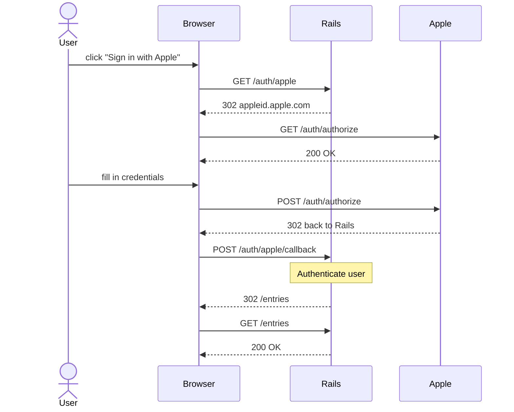
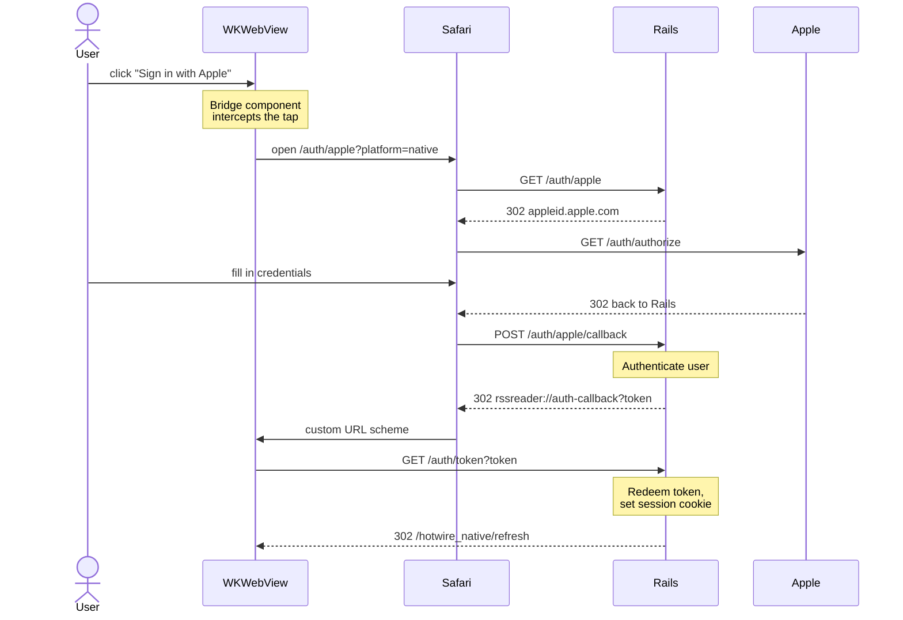

# Introduction to Hotwire Native

## Build iOS and Android apps with Ruby on Rails

Mike Dalton

<QaQrCode v-drag="[800,400,140,150]" />

---
layout: inline-image
text: Hi, I'm Mike
image: /images/mike-dalton.jpg
position: before
imageClass: h-64 w-64 rounded-full object-cover
---


<QaQrCode v-drag="[800,400,140,150]" />

<!--
Hi! I'm Mike. You may know me as this floating head from social media. I've had a couple people mention it doesn't quite look like me anymore so I've updated it to include a mustache.
-->

---
class: text-center
---

# I'm from Philadelphia


<div v-drag="[711,247,12,12]" data-id="philly-dot" class="rounded-full bg-red-600 ring-2 ring-red-300"></div>

<div v-drag="[740,135,170,40]" data-id="philly-label" class="text-2xl font-bold text-red-600 whitespace-nowrap">Philadelphia</div>

<div class="absolute inset-0 pointer-events-none" style="z-index: 200">
  <FancyArrow from="(786,164)" to="(720,250)" color="#dc2626" width="2.5" head-size="18" roughness="1.2" arc="0.2" seed="7" />
</div>

<QaQrCode v-drag="[800,400,140,150]" />

<!--
I live in Philadelphia on the eastern coast of the United States which is in between New York City and Washington DC.
-->

---
layout: image
image: /images/iasip-new.png
backgroundSize: cover
title: It's Always Sunny
---

<!--
You may know about Philadelphia from this group of friends. This is the cast of "It's Always Sunny in Philadelphia".
-->

---
layout: image
image: /images/rocky-italian-market.jpg
backgroundSize: cover
title: Rocky running through the Italian Market
---

<!--
Or you may know Philadelphia from the movie "Rocky". This scene was filmed about a 10 minute walk from my house. The neighborhood still looks pretty much the same even though this is from 50 years ago.
-->

---
layout: image
image: /images/cheesesteak.jpg
backgroundSize: cover
title: Philly cheesesteak
---

<!--
Or you may know Philadelphia from its most popular food, the Philly Cheese Steak.
-->

---
layout: inline-image
text: I work at
image: /images/triumph-logo.svg
position: after
imageClass: w-90
---

<!--
I work at a US-based company called Triumph.
-->

---
layout: image
image: /images/triumph-site-1.png
backgroundSize: contain
title: Triumph website
---

---
layout: image
image: /images/triumph-site-2.png
backgroundSize: contain
title: Triumph website (cont.)
---

---
layout: image
image: /images/triumph-bus.jpg
backgroundSize: cover
title: Triumph matatu in Nairobi
---

<!--
Not this Triumph
-->

---
layout: image
image: /images/triumph-site-3.png
backgroundSize: contain
title: Triumph website (triumph.io)
---

---
layout: inline-image
text: Building Calendar Vision
image: /images/calendar-vision-logo.png
position: before
imageClass: w-60 rounded-2xl
---

<!--
And in my free time, I like working on side projects like Calendar Vision.
-->

---
title: Calendar Vision screenshots
---


<!--
Calendar Vision is a Hotwire Native app that allows people to take a picture of an image and easily extract events from that photo to add to your favorite calendar app.
-->

---
layout: title-left
---

::title::

# RSS Reader

::default::


---
layout: section
---

# Hotwire

<QaQrCode v-drag="[800,400,140,150]" />

---
layout: image-right
image: /images/hotwire-37signals.png
---

# Hotwire

- Created by 37signals
- Default front end "framework" in Rails 7+
- HTML (not JSON) "over the wire"

<!--
Before we get into Hotwire Native, I want to talk a little bit about Hotwire itself.

Hotwire is the default front end framework in Rails since Rails 7. It was created by 37signals.

Hotwire stands for "HTML over the wire"
-->

---
layout: quote
---

# "Hotwire is an alternative approach to building modern web applications without using much JavaScript by sending HTML instead of JSON over the wire."

[https://hotwired.dev/](https://hotwired.dev/)

<!--
This is a quote from the Hotwire website and I think it does a good job of summarizing the framework.
-->

---
layout: center
title: Hotwire libraries
---


<!--
Hotwire is made up of 3 parts: Turbo, Stimulus and Hotwire Native
-->

---
layout: center
title: The three parts of Turbo
---

<h1 class="text-center">Turbo</h1>

<div class="mt-12 flex items-start justify-center gap-14">

<div v-for="part in [
  { name: 'Turbo Drive', blurb: 'Swaps the whole page', cells: [1,1,1,1] },
  { name: 'Turbo Frames', blurb: 'Swaps one region', cells: [0,1,0,0] },
  { name: 'Turbo Streams', blurb: 'Swaps many regions', cells: [1,0,1,0] },
]" :key="part.name" class="flex flex-col items-center gap-3">

  <div class="w-44 rounded-lg border-2 border-gray-300 dark:border-gray-600 p-2 flex flex-col gap-2">
    <div
      v-for="(on, i) in part.cells" :key="i"
      class="h-8 rounded transition-colors"
      :class="on ? 'bg-[#5CD8E5]' : 'bg-gray-200 dark:bg-gray-700'"
    />
  </div>

  <div class="text-lg font-semibold">{{ part.name }}</div>
  <div class="text-sm opacity-60 -mt-2">{{ part.blurb }}</div>

</div>

</div>

<!--
Turbo is made up of three parts. Turbo Drive, Turbo Frames and Turbo Streams. A good way to think about them is that Turbo Drive modifies the entire page. Turbo Frames modifies a single part of the page and Turbo Streams modified many different parts of the page. 
-->

---
layout: two-cols
class: text-xs
---

# Turbo Drive

<br>

<CodeCaption caption="app/javascript/application.js">

```js
import "@hotwired/turbo-rails"
```

</CodeCaption>

<br>

<CodeCaption caption="app/views/feeds/_card.html.erb">

```erb
<%= link_to "View", feed_path(feed) %>
```

</CodeCaption>

::right::

<DemoVideo src="/videos/turbo-drive-demo.mp4" maxH="max-h-105" />

<!--
You get Turbo Drive for free just by using the framework.

There's nothing additional you need to do. Turbo Drive works behind the scene's by intercepting link clicks and form submissions and instead of refreshing the page it will perform the requests in the background and swap in the response it receives from the server.

Turbo Drive will also pre-fetch links that are hovered over so the page loads faster for the user clicking on the link.
-->

---
layout: two-cols
class: text-xs
---

# Turbo Frames

<br>

<CodeCaption caption="app/views/feeds/_title.html.erb">

```erb
<%= turbo_frame_tag dom_id(feed, :title) do %>
  <h3>
    <%= link_to feed.title, edit_feed_title_path(feed) %>
  </h3>
<% end %>
```

</CodeCaption>

<br>

<CodeCaption caption="app/views/feeds/titles/edit.html.erb">

```erb
<%= turbo_frame_tag dom_id(@feed, :title) do %>
  <%= form_with model: @feed,
        url: feed_title_path(@feed),
        method: :patch do |form| %>
    <%= form.text_field :title %>
    <%= form.submit "Save" %>
  <% end %>
<% end %>
```

</CodeCaption>

::right::

<DemoVideo src="/videos/turbo-frames-demo.mp4" maxH="max-h-105" />

<!--
Turbo Frames allow you to update a specific part of the page without changing the entire page.

In this example, we allow the user to edit the title of a feed by clicking on the title.
Clicking on the title performs a request that loads a form with a textbox inline.
Changing the title and clicking save performs a request that updates the title and shows the new title.

Importantly, only what's inside the turbo frame changes on each request.

This works because the turbo frame has the same ID across requests.
-->

---
layout: two-cols
class: text-xs
---

# Turbo Streams

<br>

<CodeCaption caption="app/controllers/entries_controller.rb">

```ruby
def toggle_ignore
  @entry = current_user.entries.find(params[:id])
  @entry.update(ignored_at: Time.current)
end
```

</CodeCaption>

<br>

<CodeCaption caption="app/views/entries/toggle_ignore.turbo_stream.erb">

```erb
<%= turbo_stream.remove dom_id(@entry, :card) %>
```

</CodeCaption>

::right::

<div class="h-full relative" style="z-index: 1">

<DemoVideo src="/videos/turbo-streams-demo.mp4" maxH="max-h-105" />

</div>

<div class="absolute inset-0 pointer-events-none" style="z-index: 200">
  <FancyArrow from="(866,52)" to="(729,110)" color="#dc2626" width="2.5" head-size="18" roughness="1.2" arc="0.25" seed="11" />
  <div v-drag="[792,18,150,24]" class="text-sm font-bold text-red-600 whitespace-nowrap text-right">unread count</div>
</div>

<!--
Turbo Streams allows updating many different parts of the page.

For example, if the user clicks the Ignore button, we can respond with a turbo stream request that says to remove the entire entry card after we set the entry to be ignored in the database.
-->

---
layout: two-cols
class: text-xs
---

# Stimulus

<br>

<CodeCaption caption="app/javascript/controllers/toast_controller.js">

```js
import { Controller } from "@hotwired/stimulus"

export default class extends Controller {
  connect() {
    this.timeout = setTimeout(() => {
      this.element.remove()
    }, 5000)
  }

  disconnect() {
    clearTimeout(this.timeout)
  }
}
```

</CodeCaption>

<br>

<CodeCaption caption="app/views/shared/_flash_toasts.html.erb">

```erb
<div class="toast" data-controller="toast">
  <h2><%= flash[:notice] %></h2>
</div>
```

</CodeCaption>

::right::

<DemoVideo src="/videos/stimulus-demo.mp4" maxH="max-h-105" />

<!--
When Turbo isn't enough and you need some custom Javascript, you can use Stimulus.

I like to think of Stimulus as a more structured version of jQuery.

For example, if we want to show the user a toast message and have it disappear after five seconds, Stimulus is a great choice.

We set the data-controller attribute on the element which tells Stimulus to connect to that controller.

Then we set a timeout that removes the element after five seconds have passed.
-->

---
layout: section
---

# Mobile Frameworks

---

# Native Alternatives

<div class="flex gap-12 items-start justify-center mt-8">
  <div class="text-center">
    <div class="font-bold mb-2">Android (Kotlin)</div>
    
  </div>
  <div class="text-center">
    <div class="font-bold mb-2">iOS (Swift)</div>
    
  </div>
</div>

<!--
The most obvious choices are native apps written in Swift and Kotlin.
-->

---

# Crossplatform Alternatives

<div class="grid grid-cols-3 gap-x-8 gap-y-2 mt-4 text-center">
  <div>
    <div class="font-bold text-sm">Kotlin Multiplatform</div>
    
    <div class="text-xs opacity-60">Kotlin</div>
  </div>
  <div>
    <div class="font-bold text-sm">React Native</div>
    
    <div class="text-xs opacity-60">React</div>
  </div>
  <div>
    <div class="font-bold text-sm">.NET MAUI</div>
    
    <div class="text-xs opacity-60">C#</div>
  </div>
  <div>
    <div class="font-bold text-sm">Flutter</div>
    
    <div class="text-xs opacity-60">Dart</div>
  </div>
  <div>
    <div class="font-bold text-sm">Ionic</div>
    
    <div class="text-xs opacity-60">Angular, React or Vue</div>
  </div>
  <div>
    <div class="font-bold text-sm">Swift for Android</div>
    
    <div class="text-xs opacity-60">Swift</div>
  </div>
</div>

<!--
The biggest downside of building native apps is that you need to build two separate mobile apps. Three if you need a web app.

Besides Hotwire Native, there are many cross platform frameworks.
-->

---
layout: image
image: /images/hotwire-native-history.png
backgroundSize: contain
title: Hotwire Native
---

<!--
That brings us to the subject of this talk, Hotwire Native.
-->

---
layout: image-right
image: /images/hotwire-native-history.png
---

# Hotwire Native

## History

<br>

- Created by 37signals
- Turbo Native released in 2020
- Strada released in 2023
- Rebranded Hotwire Native in 2024

<!--
Like Turbo and Stimulus, Hotwire Native was created by 37signals.

You may know it by a couple different names because it's gone through some name changes since being introduced.
-->

---

# Hotwire Native

## Who should use it

<br>

- You have the need for a web app, iOS and Android app
- You want to build with Hotwire and Turbo
- You're comfortable being an early adopter

<!--
Before choosing Hotwire Native, there are several things to consider.

It's a great choice if you have a need for a web app as well as mobile apps.

In addition to using Rails, you need to be using Hotwire and Turbo instead of another front end framework like React.

You should be comfortable being an early adopter since it's still relatively new.
-->

---

# Hotwire Native

## How does it work

<br>

- Native navigation and animation
- Embedded web browser
- Doesn't look like a browser
- Views look the same as the web

---
layout: section
---

# Project Setup

<QaQrCode v-drag="[800,400,140,150]" />

<!--
How do you get started with a Hotwire Native project?
-->

---
layout: statement
---

# Start with a Hotwire Rails app

---
layout: statement
---

# No generator like `rails new` for the mobile app

---
layout: statement
---

# Hotwire Native apps are Native apps

---
layout: image-right
image: /images/setup-ios-xcode-template.png
backgroundSize: 90%
---

# Project Setup

## iOS

<br>

- Use the Xcode New Project Wizard

---
layout: image-right
image: /images/setup-ios-package-dependency.png
backgroundSize: 90%
---

<!--
To get started with iOS, you can use the Xcode new project wizard.
-->

# Project Setup

## iOS

<br>

- Add `hotwire-native-ios` package dependency

<!--
There's a Swift package called `hotwire-native-ios` and that's what you'll use to turn your native app into a Hotwire Native app
-->

---
layout: two-cols
---

# Project Setup

## iOS

<br>

- Replace `SceneDelegate.swift`

::right::

<Center>

<CodeCaption caption="SceneDelegate.swift" size="xs">

```swift
import HotwireNative
import UIKit

let rootURL = URL(string: "https://hotwire-native-demo.dev")!

class SceneDelegate: UIResponder, UIWindowSceneDelegate {
    var window: UIWindow?

    private let navigator = Navigator(configuration: .init(
        name: "main",
        startLocation: rootURL
    ))

    func scene(
        _ scene: UIScene,
        willConnectTo session: UISceneSession,
        options connectionOptions: UIScene.ConnectionOptions
    ) {
        window?.rootViewController = navigator.rootViewController
        navigator.start()
    }
}
```

</CodeCaption>

</Center>

<!--
The only change you'll need to make is to replace the entry point of the app with a small bit of code that tells Hotwire Native the starting location of your web app.
-->

---
layout: image-right
image: /images/setup-android-new-project.png
backgroundSize: 90%
---

# Project Setup

## Android

<br>

- Use the Android Studio New Project Wizard

<!--
Android has a similar new project wizard.
-->

---
layout: two-cols
---

# Project Setup

## Android

<br>

- Add `hotwire-native-android` dependency

::right::

<Center>

<CodeCaption caption="app/build.gradle.kts" size="xs">

```kotlin
dependencies {
    implementation("dev.hotwire:core:${libs.versions.hotwireNative}")
    implementation(
        "dev.hotwire:navigation-fragments:${libs.versions.hotwireNative}"
    )
}
```

</CodeCaption>

</Center>

<!--
Android has a `hotwire-native-android` Kotlin library that needs to be added to your dependencies.
-->

---
layout: two-cols
---

# Project Setup

## Android

<br>

- Enable internet access

::right::

<Center>

<CodeCaption caption="app/src/main/AndroidManifest.xml" size="xs">

```xml
<manifest xmlns:android="http://schemas.android.com/apk/res/android">
    <uses-permission android:name="android.permission.INTERNET"/>
</manifest>
```

</CodeCaption>

</Center>

<!--
Android has requires a little more than iOS to get started. Start by asking for the internet permission for your app. This tells Android that you need to be able to call your web app from within your native app.
-->

---
layout: two-cols
---

# Project Setup

## Android

<br>

- Replace `MainActivity.kt`

::right::

<Center>

<CodeCaption caption="MainActivity.kt" size="xs">

```kotlin
package com.example.myapplication

import android.os.Bundle
import android.view.View
import androidx.activity.enableEdgeToEdge
import dev.hotwire.navigation.activities.HotwireActivity
import dev.hotwire.navigation.navigator.NavigatorConfiguration
import dev.hotwire.navigation.util.applyDefaultImeWindowInsets

class MainActivity : HotwireActivity() {
    override fun onCreate(savedInstanceState: Bundle?) {
        enableEdgeToEdge()
        super.onCreate(savedInstanceState)
        setContentView(R.layout.activity_main)
        findViewById<View>(R.id.main_nav_host).applyDefaultImeWindowInsets()
    }

    override fun navigatorConfigurations() = listOf(
        NavigatorConfiguration(
            name = "main",
            startLocation = "https://hotwire-native-demo.dev",
            navigatorHostId = R.id.main_nav_host
        )
    )
}
```

</CodeCaption>

</Center>

<!--
Similar to iOS, the entry point for the Kotlin app needs to be updated with the starting location URL of your web app.
-->

---
layout: two-cols
---

# Project Setup

## Android

<br>

- Replace `activity_main.xml`

::right::

<Center>

<CodeCaption caption="activity_main.xml" size="xs">

```xml
<?xml version="1.0" encoding="utf-8"?>
<androidx.fragment.app.FragmentContainerView
    xmlns:android="http://schemas.android.com/apk/res/android"
    xmlns:app="http://schemas.android.com/apk/res-auto"
    android:id="@+id/main_nav_host"
    android:name="dev.hotwire.navigation.navigator.NavigatorHost"
    android:layout_width="match_parent"
    android:layout_height="match_parent"
    app:defaultNavHost="false" />
```

</CodeCaption>

</Center>

<!--
XML still seems pretty popular in the Java world so you've also got a bit of XML to add.
-->

---

# Project Setup

## Alternative


<!--
Alternatively, you can download these examples apps hosted in the official libraries and modify them instead of starting native projects from scratch.
-->

---
layout: section
---

# Screen Navigation

<QaQrCode v-drag="[800,400,140,150]" />

---
layout: two-cols
class: gap-4
---

# Screen Navigation

## Push and Pop

<br>

<CodeCaption caption="app/views/feeds/_card.html.erb">

```erb
<%= link_to "View", feed_path(feed) %>
```

</CodeCaption>

::right::

<DemoVideo src="/videos/nav-push-pop.mp4" />

<!--
Links will push a new screen onto the stack and use an animation
-->

---
layout: two-cols
class: gap-4 text-xs
---

# Screen Navigation

## Replace

<br>

<CodeCaption caption="app/views/users/edit.html.erb">

```erb
<%= form_with model: @user do |form| %>
  <div class="grid gap-2">
    <%= form.label :email_address, "New Email Address" %>
    <%= form.email_field :email_address %>
  </div>

  <div class="grid gap-2">
    <%= form.label :current_password %>
    <%= form.password_field :current_password %>
  </div>

  <%= form.submit "Update Email" %>
<% end %>
```

</CodeCaption>

::right::

<DemoVideo src="/videos/nav-replace.mp4" />

<!--
Navigating to the same screen will replace the screen instead of pushing a new screen
-->

---
layout: two-cols
class: gap-4 text-xs
---

# Screen Navigation

## External Links

<br>

<CodeCaption caption="app/views/entries/_card.html.erb">

```erb
<%= link_to entry.title,
    entry.url,
    target: "_blank",
    rel: "noopener noreferrer" %>
```

</CodeCaption>

::right::

<DemoVideo src="/videos/nav-external-links.mp4" />

---
layout: section
---

# Path Configuration

<QaQrCode v-drag="[800,400,140,150]" />

---
layout: two-cols
class: gap-4
---

# Path Configuration

## Basic Navigation

<br>

```json
{
  "rules": [
    {
      "patterns": [
        ".*"
      ],
      "properties": {
        "context": "default",
        "pull_to_refresh_enabled": true
      }
    }
  ]
}
```

::right::

<DemoVideo src="/videos/pathconfig-basic.mp4" />

<!--
https://native.hotwired.dev/reference/navigation
https://native.hotwired.dev/reference/path-configuration
-->

---
layout: two-cols
class: gap-4
---

# Path Configuration

## Modal Navigation

<br>

```json
{
  "rules": [
    {
      "patterns": [
        "/new$",
        "/edit$"
      ],
      "properties": {
        "context": "modal",
        "pull_to_refresh_enabled": false
      }
    }
  ]
}
```

::right::

<DemoVideo src="/videos/pathconfig-modal.mp4" />

<!--
https://native.hotwired.dev/reference/navigation
https://native.hotwired.dev/reference/path-configuration
-->

---
layout: two-cols
class: gap-4
---

# Path Configuration

## Native Screens

<br>

```ruby
{
  rules: [
    {
      patterns: [
        "#{entries_path}$"
      ],
      properties: {
        view_controller: "entries",
        presentation: "replace_root",
        animated: false,
        pull_to_refresh_enabled: false
      }
    }
  ]
}
```

::right::

<DemoVideo src="/videos/pathconfig-native-screen.mp4" />

<!--
https://native.hotwired.dev/reference/navigation
https://native.hotwired.dev/reference/path-configuration
-->

---
layout: section
---

# Navigation Bar Title

<QaQrCode v-drag="[800,400,140,150]" />

---
layout: two-cols-header
class: gap-4
---

# Navigation Bar Title

::left::

<Center>
  
</Center>

::right::

<Center>
  
</Center>

<div class="absolute inset-0 pointer-events-none" style="z-index: 200">
  <FancyArrow from="(255,178)" to="(690,150)" color="#dc2626" width="2.5" head-size="18" roughness="1.2" arc="0.32" seed="7" />
</div>

---
layout: two-cols
class: gap-4 text-sm
---

# Navigation Bar Title

## Add title tag

<br>

<CodeCaption caption="feeds/index.html.erb" size="sm">

```erb
<%= content_for :title, "Your Feeds" %>
```

</CodeCaption>

::right::

<Center>
  
</Center>

---
layout: two-cols
class: gap-4 text-xs
---

# Navigation Bar Title

## Hide h1 on native

<br>

<CodeCaption caption="application.html.erb" size="xs">

```erb
<%= tag.html(
  data: { hotwire_native: hotwire_native_app? },
) do %>
  ...
<% end %>
```

</CodeCaption>

<CodeCaption caption="application.css" size="xs">

```css
@variant hotwire-native {
  html[data-hotwire-native="true"] & {
    @slot
  }
}
```

</CodeCaption>

<CodeCaption caption="feeds/index.html.erb" size="xs">

```erb
<h1 class="hotwire-native:hidden text-2xl font-bold">
  Your Feeds
</h1>
```

</CodeCaption>

::right::

<Center>
  
</Center>

---
layout: section
---

# Native Tab Bar

<QaQrCode v-drag="[800,400,140,150]" />

---
layout: two-cols
---

# Native Tab Bar

<br>

- Built in to Hotwire Native
- Each tab is a…
  - separate web view
  - separate navigation stack

::right::

<DemoVideo src="/videos/tabbar-ios.mp4" />

---
layout: two-cols
class: gap-4 text-sm
---

# Native Tab Bar

## iOS

<br />

```swift
extension HotwireTab {
    static let all: [HotwireTab] = {
        var tabs: [HotwireTab] = [
            .feeds,
            ...
        ]

        return tabs
    }()

    static let feeds = HotwireTab(
        title: "Feeds",
        image: .init(systemName: "tray")!,
        url: baseUrl.appending(path: "/feeds")
    )

    ...
}
```

<div class="text-xs opacity-60 text-center">Tabs.swift</div>

::right::

<DemoVideo src="/videos/tabbar-ios.mp4" />

---
layout: two-cols
class: gap-4 text-sm
---

# Native Tab Bar

## iOS

<br />

<CodeCaption caption="SceneController.swift" size="xs">

```swift
class SceneController: UIResponder {
    ...

    private lazy var tabBarController =
        HotwireTabBarController(navigatorDelegate: self)
}

extension SceneController: UIWindowSceneDelegate {
    func scene(_ scene: UIScene,
               willConnectTo session: UISceneSession,
               options connectionOptions: UIScene.ConnectionOptions) {
        ...

        tabBarController.load(HotwireTab.all)
    }
}
```

</CodeCaption>

::right::

<DemoVideo src="/videos/tabbar-ios.mp4" />

---
layout: two-cols
class: gap-4
---

# Native Tab Bar

## Android

<br />

<CodeCaption caption="Tabs.kt">

```kotlin
private val feeds = HotwireBottomTab(
    title = "Feeds",
    iconResId = R.drawable.inbox_24px,
    configuration = NavigatorConfiguration(
        name = "feeds",
        navigatorHostId = R.id.feeds_nav_host,
        startLocation = "$baseUrl/feeds"
    )
)

...

val mainTabs = listOf(
    feeds,
    ...
)
```

</CodeCaption>

::right::

<DemoVideo src="/videos/tabbar-android.mp4" />

---
layout: two-cols
class: gap-4
---

# Native Tab Bar

## Android

<br />

<CodeCaption caption="activity_main.xml" size="xs">

```xml
<?xml version="1.0" encoding="utf-8"?>
<androidx.constraintlayout.widget.ConstraintLayout>

    <androidx.fragment.app.FragmentContainerView
        xmlns:android="http://schemas.android.com/apk/res/android"
        xmlns:app="http://schemas.android.com/apk/res-auto"
        android:id="@+id/feeds_nav_host"
        android:name="dev.hotwire.navigation.navigator.NavigatorHost"
        android:layout_width="match_parent"
        android:layout_height="0dp"
        app:defaultNavHost="false"
        app:layout_constraintBottom_toTopOf="@id/bottom_nav"
        app:layout_constraintTop_toTopOf="parent" />

    ...

    <com.google.android.material.bottomnavigation.BottomNavigationView
        android:id="@+id/bottom_nav"
        android:layout_width="match_parent"
        android:layout_height="wrap_content"
        app:labelVisibilityMode="labeled"
        app:layout_constraintBottom_toBottomOf="parent"
        app:layout_constraintEnd_toEndOf="parent"
        app:layout_constraintStart_toStartOf="parent" />
</androidx.constraintlayout.widget.ConstraintLayout>
```

</CodeCaption>

::right::

<DemoVideo src="/videos/tabbar-android.mp4" />

---
layout: two-cols
class: gap-4
---

# Native Tab Bar

## Android

<br />

<CodeCaption caption="MainActivity.kt" size="xs">

```kotlin
class MainActivity : HotwireActivity() {
    private lateinit var
      bottomNavigationController: HotwireBottomNavigationController

    override fun onCreate(savedInstanceState: Bundle?) {
        ...

        initializeBottomTabs()
    }

    private fun initializeBottomTabs() {
        val bottomNavigationView = findViewById<BottomNavigationView>(
            R.id.bottom_nav
        )
        bottomNavigationController = HotwireBottomNavigationController(
            this, bottomNavigationView
        )
        bottomNavigationController.load(mainTabs, 0)
    }
}
```

</CodeCaption>

::right::

<DemoVideo src="/videos/tabbar-android.mp4" />

---
layout: two-cols
class: gap-4 text-sm
---

# Native Tab Bar

## Hide Web Navigation

<br>

```erb
<body>
  ...

  <main>
    <% if authenticated? %>
      <header class="hotwire-native:hidden flex ...">
        <button ...>
        </button>
      </header>
    <% end %>

    <%= yield %>
  </main>

  ...
</body>
```

::right::

<div class="flex gap-4 items-center justify-center h-full">
  
  
</div>

<FancyArrow from="(540,143)" to="(715,143)" color="#dc2626" width="2.5" head-size="18" roughness="1.2" arc="0.32" seed="7" />

---
layout: section
---

# Calendar Switcher

---
layout: two-cols
---

# Calendar Switcher

## Web

::right::

<DemoVideo src="/videos/calendar-switcher-web.mp4" />

---
layout: two-cols
---

# Calendar Switcher

## iOS App (HTML Dialog)

::right::

<DemoVideo src="/videos/calendar-switcher-html-dialog.mp4" />

---
layout: two-cols
---

# Calendar Switcher

## iOS App (Native Modal)

::right::

<DemoVideo src="/videos/calendar-switcher-native-modal.mp4" />

---
layout: two-cols
class: gap-4 text-xs
---

# Web Implementation

<div class="mt-8" />

```erb
<%= link_to calendars_path,
    data: {
      turbo_stream: true
    } do %>
  <%= render "heroicons/arrows_up_down" %>
<% end %>
```

<div class="text-xs opacity-60 text-center">app/views/calendars/show.html.erb</div>

::right::

<div class="mt-14" />

```ruby
class CalendarsController < ApplicationController
  def index
    @calendars = current_user.calendars
    respond_to do |format|
      format.turbo_stream
    end
  end
end
```

<div class="text-xs opacity-60 text-center">app/controllers/calendars_controller.rb</div>

<br>

```erb
<%= turbo_stream.replace "dialog-container" do %>
  <div id="dialog-container">
    <dialog class="modal" open>
      <%= render "index", calendars: @calendars %>
    </dialog>
  </div>
<% end %>
```

<div class="text-xs opacity-60 text-center">app/views/calendars/index.turbo_stream.erb</div>

---
layout: two-cols
class: gap-4 text-xs
---

# Native Implementation

```erb
<%= link_to calendars_path,
    data: {
      turbo_stream: !hotwire_native_app?
    } do %>
  <%= render "heroicons/arrows_up_down" %>
<% end %>
```

<div class="text-xs opacity-60 text-center">app/views/calendars/show.html.erb</div>

```ruby
class ConfigurationsController < ApplicationController
  def ios_v1
    render json: {
      rules: [
        {
          patterns: [
            "#{calendars_path}$"
          ],
          properties: {
            context: "modal",
            presentation: "default",
            pull_to_refresh_enabled: false
          }
        }
      ]
    }
  end
end
```

<div class="text-xs opacity-60 text-center">app/controllers/configurations_controller.rb</div>

::right::

<div class="mt-14" />

```ruby
class CalendarsController < ApplicationController
  def index
    @calendars = current_user.calendars
    respond_to do |format|
      format.html
      format.turbo_stream
    end
  end
end
```

<div class="text-xs opacity-60 text-center">app/controllers/calendars_controller.rb</div>

<br>

```erb
<%= render "index", calendars: @calendars %>
```

<div class="text-xs opacity-60 text-center">app/views/calendars/index.html.erb</div>

---
layout: section
---

# Navigation Bar Button

<QaQrCode v-drag="[800,400,140,150]" />

---
layout: two-cols-header
class: gap-4
---

# Navigation Bar Button

## Goal

::left::

<Center>
  
</Center>

::right::

<Center>
  
</Center>

<div class="absolute inset-0 pointer-events-none" style="z-index: 200">
  <FancyArrow from="(242,208)" to="(745,182)" color="#dc2626" width="2.5" head-size="18" roughness="1.2" arc="0.32" seed="7" />
</div>

---
layout: two-cols
class: gap-4
---

# Navigation Bar Button

## Web

<CodeCaption caption="app/javascript/controllers/bridge/button_controller.js" size="sm">

```js
import { BridgeComponent } from "@hotwired/hotwire-native-bridge"

export default class extends BridgeComponent {
  static component = "button"

  connect() {
    super.connect()

    const element = this.bridgeElement
    const title = element.bridgeAttribute("title")
    this.send("connect", {title}, () => {
      this.element.click()
    })
  }
}
```

</CodeCaption>

<CodeCaption caption="app/views/feeds/index.html.erb" size="sm">

```erb
<%= link_to "Add Feed", new_feed_path,
  class: "hotwire-native:hidden btn-primary",
  data: {
    controller: "bridge--button",
    bridge_title: "Add Feed",
  } %>
```

</CodeCaption>

::right::

<Center>
  
</Center>

<FancyArrow from="(300,416)" to="(632,174)" color="#dc2626" width="2.5" head-size="18" roughness="1.2" arc="0.28" seed="11" />

---
layout: two-cols
class: gap-4
---

# Navigation Bar Button

## iOS

<CodeCaption caption="ButtonComponent.swift" size="xs">

```swift
final class ButtonComponent: BridgeComponent {
    override class var name: String { "button" }

    override func onReceive(message: Message) {
        guard let data: MessageData = message.data(),
              let viewController = delegate?.destination as? UIViewController
        else { return }

        let action = UIAction { [unowned self] _ in
            self.reply(to: "connect")
        }
        viewController.navigationItem.rightBarButtonItem =
            UIBarButtonItem(title: data.title, primaryAction: action)
    }

    struct MessageData: Decodable {
        let title: String
    }
}
```

</CodeCaption>

<CodeCaption caption="AppDelegate.swift" size="xs">

```swift
Hotwire.registerBridgeComponents([
    ButtonComponent.self
])
```

</CodeCaption>

::right::

<Center>
  
</Center>

<FancyArrow from="(385,298)" to="(752,120)" color="#dc2626" width="2.5" head-size="18" roughness="1.2" arc="0.28" seed="7" />

---
layout: two-cols
class: gap-4
---

# Navigation Bar Button

## Android

<CodeCaption caption="ButtonComponent.kt" size="xs">

```kotlin
class ButtonComponent(
    name: String,
    private val delegate: BridgeDelegate<HotwireDestination>
) : BridgeComponent<HotwireDestination>(name, delegate) {

    override fun onReceive(message: Message) {
        when (message.event) {
            "connect" -> handleConnectEvent(message)
            else -> Log.w("ButtonComponent", "Unknown event")
        }
    }

    private fun handleConnectEvent(message: Message) {
        val data = message.data<MessageData>() ?: return
        // Add a toolbar button titled data.title that
        // calls replyTo("connect") when tapped.
    }

    @Serializable
    data class MessageData(@SerialName("title") val title: String)
}
```

</CodeCaption>

<CodeCaption caption="MainApplication.kt" size="xs">

```kotlin
Hotwire.registerBridgeComponents(
    BridgeComponentFactory("button", ::ButtonComponent)
)
```

</CodeCaption>

::right::

<DemoVideo src="/videos/bridge-button-android.mp4" maxH="max-h-100" />

---
layout: section
---

# Bridge Components

<QaQrCode v-drag="[800,400,140,150]" />

---
layout: title-left
title: Bridge Components - Navigation Bar Menu
---

::title::

# Bridge Components

## Navigation Bar Menu

::default::

<DemoVideo src="/videos/bridge-menu-android.mp4" maxH="max-h-100" />

---
layout: title-left
---

::title::

# Bridge Components

## Toast Messages

::default::

<div class="flex gap-8 items-center justify-center mt-4">
  
  
</div>

---
layout: title-left
---

::title::

# Bridge Components

## Request Permissions

::default::


---
layout: image
image: /images/masilotti-library.png
backgroundSize: contain
title: Joe Masilotti's Bridge Components library
---

---
layout: section
---

# Native Components

<QaQrCode v-drag="[800,400,140,150]" />

---
layout: two-cols
class: gap-4
---

# Add to Calendar

## Rails

<CodeCaption caption="app/javascript/controllers/bridge/add_to_calendar_controller.js" size="sm">

```js
import { BridgeComponent } from "@hotwired/hotwire-native-bridge"

export default class extends BridgeComponent {
  static component = "add-to-calendar"
  static values = {
    eventPayload: Object,
  }

  add() {
    this.send("add", this.eventPayloadValue)
  }
}
```

</CodeCaption>

<CodeCaption caption="app/views/calendar_events/_add_to_calendar.html.erb" size="sm">

```erb
<% payload = calendar_event_json_payload(calendar_event) %>
<%= tag.div data: {
  controller: "bridge--add-to-calendar",
  bridge__add_to_calendar_event_payload_value: payload.to_json
} do %>
  <%= button_tag data: {
    action: "bridge--add-to-calendar#add:prevent",
  } do %>
    <i class="fa-regular fa-calendar-plus fa-lg"></i>
  <% end %>
<% end %>
```

</CodeCaption>

::right::

<Center>
  <div class="w-45 h-90 border-2 border-dashed rounded-lg opacity-40 flex items-center justify-center text-center text-sm p-4">
    TODO: screenshot of the Add to Calendar button on the web
  </div>
</Center>

---
layout: two-cols
class: gap-4
---

# Add to Calendar

## iOS

<CodeCaption caption="AddToCalendarComponent.swift" size="xs">

```swift
final class AddToCalendarComponent: BridgeComponent {
    private var viewController: UIViewController? {
        delegate?.destination as? UIViewController
    }

    override func onReceive(message: Message) {
        guard message.event == "add",
              let calendarEvent: CalendarEvent = message.data()
        else { return }

        Task {
            await presentEventEditor(calendarEvent: calendarEvent)
        }
    }

    ...
}
```

</CodeCaption>

<CodeCaption caption="AppDelegate.swift" size="xs">

```swift
Hotwire.registerBridgeComponents([
    AddToCalendarComponent.self
])
```

</CodeCaption>

::right::

<DemoVideo src="/videos/add-to-calendar-ios.mp4" maxH="max-h-100" />

---
layout: two-cols
class: gap-4
---

# Add to Calendar

## iOS (continued)

<CodeCaption caption="AddToCalendarComponent.swift" size="xs">

```swift
private func presentEventEditor(calendarEvent: CalendarEvent) async {
    let event = EKEventBuilder.makeEvent(
        from: calendarEvent,
        eventStore: CalendarEventStore.shared
    )

    await MainActor.run {
        let editDelegate = EventEditDelegate()
        let eventViewController = EKEventEditViewController()
        eventViewController.event = event
        eventViewController.eventStore = CalendarEventStore.shared
        eventViewController.editViewDelegate = editDelegate
        viewController?.present(eventViewController, animated: true)
    }
}

private final class EventEditDelegate: NSObject, EKEventEditViewDelegate {
    func eventEditViewController(
        _ controller: EKEventEditViewController,
        didCompleteWith action: EKEventEditViewAction
    ) {
        controller.dismiss(animated: true)
    }
}
```

</CodeCaption>

::right::

<Center>
  <div class="w-45 h-90 border-2 border-dashed rounded-lg opacity-40 flex items-center justify-center text-center text-sm p-4">
    TODO: screenshot of the native event editor
  </div>
</Center>

---
layout: two-cols
class: gap-4
---

# Add to Calendar

## Android

<CodeCaption caption="AddToCalendarComponent.kt" size="xs">

```kotlin
class AddToCalendarComponent(
    name: String,
    private val bridgeDelegate: BridgeDelegate<HotwireDestination>
) : BridgeComponent<HotwireDestination>(name, bridgeDelegate) {
    override fun onReceive(message: Message) {
        when (message.event) {
            "add" -> handleAddToCalendar(message)
        }
    }

    private fun handleAddToCalendar(message: Message) {
        val calendarEvent = message.data<CalendarEvent>()
        val activity = bridgeDelegate.destination
            .fragment.requireActivity()
        openCalendarEventInIntent(calendarEvent, activity)
    }

    ...
}
```

</CodeCaption>

<CodeCaption caption="MainApplication.kt" size="xs">

```kotlin
Hotwire.registerBridgeComponents(
    BridgeComponentFactory("add-to-calendar", ::AddToCalendarComponent)
)
```

</CodeCaption>

::right::

<DemoVideo src="/videos/add-to-calendar-android.mp4" maxH="max-h-100" />

---
layout: two-cols
class: gap-4
---

# Add to Calendar

## Android (continued)

<CodeCaption caption="AddToCalendarComponent.kt" size="xs">

```kotlin
private fun openCalendarEventInIntent(
    calendarEvent: CalendarEvent,
    activity: android.app.Activity
) {
    var intent = Intent(Intent.ACTION_INSERT)
        .setData(CalendarContract.Events.CONTENT_URI)
        .putExtra(CalendarContract.Events.TITLE, calendarEvent.name)
        .putExtra(
            CalendarContract.EXTRA_EVENT_BEGIN_TIME,
            calendarEvent.startsAtInMillisecondsSinceEpoch
        )
        .putExtra(
            CalendarContract.EXTRA_EVENT_END_TIME,
            calendarEvent.endsAtInMillisecondsSinceEpoch
        )
    activity.startActivity(intent)
}
```

</CodeCaption>

::right::

<Center>
  <div class="w-45 h-90 border-2 border-dashed rounded-lg opacity-40 flex items-center justify-center text-center text-sm p-4">
    TODO: screenshot of the calendar intent on Android
  </div>
</Center>

---
layout: section
---

# OAuth

<QaQrCode v-drag="[800,400,140,150]" />

---
layout: title-left
title: OAuth - End to end
---

::title::

# OAuth

## Sign in with Apple

::default::

<DemoVideo src="/videos/oauth-sign-in-ios.mp4" maxH="max-h-100" />

---
layout: title-left
title: OAuth - The problem
---

::title::

# OAuth

## Web view problem

::default::


---
layout: title-left
title: OAuth - Web
---

::title::

# OAuth

## Web

::default::



---
layout: title-left
title: OAuth - Native
---

::title::

# OAuth

## Native

::default::



---
layout: two-cols
class: gap-4 text-xs
---

# OAuth

## Sign in button

<br>

<CodeCaption caption="app/views/shared/_oauth_button.html.erb" size="xs">

```erb {4-9}
<%= link_to auth_path(platform: "web"),
  data: {
    turbo: false,
    controller: "bridge--sign-in-with-oauth",
    action: "click->bridge--sign-in-with-oauth#interceptClick",
    bridge__sign_in_with_oauth_start_path_value:
      auth_path(platform: "native"),
    bridge__sign_in_with_oauth_token_auth_path_value:
      auth_token_path
  } do %>
  Sign in with Apple
<% end %>
```

</CodeCaption>

::right::

<Center>
  
</Center>

<FancyArrow from="(858,255)" to="(795,310)" color="#dc2626" width="2.5" head-size="18" roughness="1.2" arc="0.25" seed="13" />
<div v-drag="[778,222,160,24]" class="text-sm font-bold text-red-600 whitespace-nowrap text-right"> Sign in with Apple button</div>

---
layout: two-cols
class: gap-4 text-xs
---

# OAuth

## Bridge component, Web

<br>

<CodeCaption caption="app/javascript/controllers/bridge/sign_in_with_oauth_controller.js" size="xs">

```js
import { BridgeComponent } from "@hotwired/hotwire-native-bridge"

export default class extends BridgeComponent {
  static component = "sign-in-with-oauth"
  static values = {
    startPath: String,
    tokenAuthPath: String,
  }

  interceptClick(event) {
    event.preventDefault()

    const startPath = this.startPathValue
    const tokenAuthPath = this.tokenAuthPathValue
    this.send("click", { startPath, tokenAuthPath })
  }
}
```

</CodeCaption>

::right::

<Center>
  
</Center>

<FancyArrow from="(616,312)" to="(210,290)" color="#dc2626" width="2.5" head-size="18" roughness="1.2" arc="0.18" seed="13" />

---
layout: two-cols
class: gap-4 text-xs
---

# OAuth

## Bridge component, iOS

<br>

<CodeCaption caption="Components/SignInWithOauthComponent.swift" size="xxs">

```swift
final class SignInWithOauthComponent: BridgeComponent {
    override nonisolated class var name: String {
        "sign-in-with-oauth"
    }

    override func onReceive(message: Message) {
        guard let data: MessageData = message.data() else { return }
        self.tokenAuthPath = data.tokenAuthPath

        let startUrl = URL(string: "\(baseUrl)\(data.startPath)")!
        let safariVC = SFSafariViewController(url: startUrl)
        safariVC.modalPresentationStyle = .pageSheet
        viewController?.present(safariVC, animated: true)
    }
}
```

</CodeCaption>

<CodeCaption caption="AppDelegate.swift" size="xxs">

```swift
Hotwire.registerBridgeComponents([
    SignInWithOauthComponent.self,
])
```

</CodeCaption>

::right::

<Center>
  
</Center>

<FancyArrow from="(348,310)" to="(610,278)" color="#dc2626" width="2.5" head-size="18" roughness="1.2" arc="-0.18" seed="17" />

---
layout: two-cols
class: gap-4 text-xs
---

# OAuth

## Bridge component, Android

<br>

<CodeCaption caption="components/SignInWithOauthComponent.kt" size="xxs">

```kotlin
class SignInWithOauthComponent(
    name: String,
    private val delegate: BridgeDelegate<HotwireDestination>
) : BridgeComponent<HotwireDestination>(name, delegate) {
    override fun onReceive(message: Message) {
        when (message.event) {
            "click" -> handleClick(message)
        }
    }

    private fun handleClick(message: Message) {
        val data = message.data<MessageData>() ?: return
        tokenAuthPath = data.tokenAuthPath

        val startUrl = "$baseUrl${data.startPath}".toUri()
        CustomTabsIntent.Builder().setShowTitle(true).build()
            .launchUrl(fragment.requireContext(), startUrl)
    }

    @Serializable
    data class MessageData(
        @SerialName("startPath") val startPath: String,
        @SerialName("tokenAuthPath") val tokenAuthPath: String
    )
}
```

</CodeCaption>

::right::

<Center>
  
</Center>

<FancyArrow from="(352,358)" to="(620,358)" color="#dc2626" width="2.5" head-size="18" roughness="1.2" arc="-0.22" seed="29" />

---
layout: two-cols
class: gap-4 text-xs
---

# OAuth

## Starting the flow

<br>

<CodeCaption caption="app/controllers/oauth_sessions_controller.rb" size="xs">

```ruby
def create
  state = OauthState.generate(platform: params[:platform])

  cookies.encrypted[:oauth_state] = {
    value: state.to_message,
    expires: 1.hour.from_now,
    same_site: request.ssl? ? :none : :lax,
    secure: request.ssl?
  }

  redirect_to apple_client.authorization_url(
    state: state.to_message,
    nonce: state.nonce,
    redirect_uri: callback_auth_url
  ), allow_other_host: true
end
```

</CodeCaption>

::right::

<DemoVideo src="/videos/oauth-apple-consent.mp4" />

<FancyArrow from="(318,301)" to="(600,255)" color="#dc2626" width="2.5" head-size="18" roughness="1.2" arc="-0.18" seed="23" />

---
layout: two-cols
class: gap-4 text-xs
---

# OAuth

## Handling the callback

<br>

<CodeCaption caption="app/controllers/oauth_sessions_controller.rb" size="xs">

```ruby {1,15-19}
NATIVE_CALLBACK_URL = "rssreader://auth-callback"

def callback
  state = verified_state
  return redirect_to welcome_path, alert: INVALID_REQUEST unless state

  credentials = apple_client.authenticate(
    code: params[:code],
    redirect_uri: callback_auth_url,
    nonce: state.nonce
  )

  user = User.find_or_create_from_oauth(credentials)

  if state.native?
    token = user.signed_id(purpose: :native_auth,
                           expires_in: 5.minutes)
    redirect_to "#{NATIVE_CALLBACK_URL}?token=#{token}",
                allow_other_host: true
  else
    start_new_session_for user
    redirect_to after_authentication_url
  end
end
```

</CodeCaption>

::right::

<DemoVideo src="/videos/oauth-callback-redirect.mp4" />

<FancyArrow from="(377,396)" to="(600,388)" color="#dc2626" width="2.5" head-size="18" roughness="1.2" arc="0.15" seed="29" />

---
layout: two-cols
class: gap-4 text-xs
---

# OAuth

## Exchanging the token

<br>

<CodeCaption caption="app/controllers/oauth_sessions_controller.rb" size="xs">

```ruby
def authenticate_by_token
  user = User.find_signed(params[:token], purpose: :native_auth)

  if user
    start_new_session_for user
    redirect_to after_authentication_url
  else
    redirect_to welcome_path, alert: UNABLE_TO_SIGN_IN
  end
end
```

</CodeCaption>

<CodeCaption caption="config/routes.rb" size="xs">

```ruby
get "token", to: "oauth_sessions#authenticate_by_token"
```

</CodeCaption>

::right::

<DemoVideo src="/videos/oauth-callback-redirect.mp4" />

---
layout: two-cols
class: gap-4 text-xs
---

# OAuth

## Catching the redirect, iOS

<br>

<CodeCaption caption="SceneController.swift" size="xxs">

```swift
func scene(_ scene: UIScene,
           openURLContexts URLContexts: Set<UIOpenURLContext>) {
    guard let url = URLContexts.first?.url else { return }
    guard url.host == "auth-callback" else { return }

    let components = URLComponents(url: url,
                                   resolvingAgainstBaseURL: false)
    let token = components?.queryItems?
        .first(where: { $0.name == "token" })?.value

    NotificationCenter.default.post(
        name: .signInWithOauthCompleted,
        object: nil,
        userInfo: ["token": token]
    )
}
```

</CodeCaption>

<CodeCaption caption="Info.plist" size="xxs">

```xml
<key>CFBundleURLSchemes</key>
<array>
  <string>rssreader</string>
</array>
```

</CodeCaption>

::right::

<DemoVideo src="/videos/oauth-callback-redirect.mp4" />

---
layout: two-cols
class: gap-4 text-xs
---

# OAuth

## Web view sign in, iOS

<br>

<CodeCaption caption="Components/SignInWithOauthComponent.swift" size="xxs">

```swift
@objc private func handleAuthCompletion(_ notification: Notification) {
    let token = notification.userInfo?["token"] as? String

    safariViewController?.dismiss(animated: true) { [weak self] in
        self?.authenticateWithToken(token)
    }
}

private func authenticateWithToken(_ token: String) {
    let url = URL(string: "\(baseUrl)\(tokenAuthPath)?token=\(token)")!

    // Load in the web view so the cookie lands there
    webView.load(URLRequest(url: url))
}
```

</CodeCaption>

<CodeCaption caption="app/controllers/oauth_sessions_controller.rb" size="xxs">

```ruby
def authenticate_by_token
  user = User.find_signed(params[:token], purpose: :native_auth)

  if user
    start_new_session_for user
    redirect_to after_authentication_url
  else
    redirect_to welcome_path, alert: UNABLE_TO_SIGN_IN
  end
end
```

</CodeCaption>

::right::

<DemoVideo src="/videos/oauth-callback-redirect.mp4" />

---
layout: two-cols
class: gap-4 text-xs
---

# OAuth

## Catching the redirect, Android

<br>

<CodeCaption caption="MainActivity.kt" size="xxs">

```kotlin
override fun onNewIntent(intent: Intent) {
    super.onNewIntent(intent)
    setIntent(intent)
    handleIntent(intent)
}

private fun handleIntent(intent: Intent) {
    if (intent.action == Intent.ACTION_VIEW && intent.data != null) {
        handleDeepLink(intent.data!!)
    }
}

private fun handleDeepLink(uri: Uri) {
    when (uri.host) {
        "auth-callback" -> {
            val token = uri.getQueryParameter("token")
            authTokenLiveData.postValue(token)
        }
    }
}
```

</CodeCaption>

<CodeCaption caption="AndroidManifest.xml" size="xxs">

```xml
<intent-filter>
  <action android:name="android.intent.action.VIEW" />
  <category android:name="android.intent.category.DEFAULT" />
  <category android:name="android.intent.category.BROWSABLE" />
  <data android:scheme="rssreader" android:host="auth-callback" />
</intent-filter>
```

</CodeCaption>

::right::

<DemoVideo src="/videos/oauth-callback-redirect-android.mp4" />

---
layout: two-cols
class: gap-4 text-xs
---

# OAuth

## Web view sign in, Android

<br>

<CodeCaption caption="components/SignInWithOauthComponent.kt" size="xs">

```kotlin
private fun observeAuthCompletion() {
    MainActivity.authTokenLiveData.observe(fragment.viewLifecycleOwner) {
        token -> authenticateWithToken(token)
    }
}

private fun authenticateWithToken(token: String?) {
    val navigator = fragment?.navigator ?: return

    // Route in the web view so the cookie lands there
    val tokenLoginUrl = "$baseUrl$tokenAuthPath".toUri()
        .buildUpon()
        .appendQueryParameter("token", token)
        .build()

    navigator.route(tokenLoginUrl.toString())
}
```

</CodeCaption>

::right::

<DemoVideo src="/videos/oauth-callback-redirect-android.mp4" />

---
layout: section
---

# Review

<QaQrCode v-drag="[800,400,140,150]" />

---
layout: statement
---

# Native navigation and animation

---
layout: statement
---

# Path configuration to change navigation behavior

---
layout: statement
---

# A native tab bar is an easy native component to add

---
layout: statement
---

# Bridge components when you need a little bit of native functionality

---
layout: statement
---

# Native components when bridge components aren't enough

---
layout: two-cols
---

# Resources

<br>

- Hotwire Native Handbook by 37signals
- *Hotwire Native for Rails Developers* book by Joe Masilotti
- Learn Hotwire course by Chris Oliver and William Kennedy

::right::

<div class="flex flex-col gap-4 items-center justify-center h-full">
  
  
</div>

---
layout: image
image: /images/outro-1.png
backgroundSize: contain
title: Outro
---

---
layout: image
image: /images/outro-2.png
backgroundSize: contain
title: Outro (cont.)
---

---
layout: center
class: text-center
---

# Thanks!

<div class="flex gap-12 items-start justify-center mt-10">
  <div class="flex flex-col items-center gap-3 w-56">
    
    <div class="text-sm opacity-80">Calendar Vision app · calendarvision.app</div>
  </div>
  <div class="flex flex-col items-center gap-3 w-56">
    
    <div class="text-sm opacity-80">Find me online · mikedalton.co/socials</div>
  </div>
  <div class="flex flex-col items-center gap-3 w-56">
    
    <div class="text-sm opacity-80">Questions? · Session Q&amp;A</div>
  </div>
</div>
